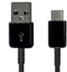

TOPST AID3-User Guide for Edu and ProQuick Start Guide	Rev. 01.010

![ref1]
1. # **Introduction**
This document describes the overall components of the TOPST D3 (Open platform board) and their usage. 

Follow the instructions to start using the TOPST D3.This document contains content that helps users set up their development environment. If you follow the guides shown below, you

can create an environment that you can develop directly on the TOPST AI (Open platform board).

- Device Guide

FWDN Guide

Booting Guide
1. ## **Scope**
The TCC805x video sub-system includes a multi-standard video codec (CODA960), HEVC/VP9 video decoder (WAVE512), HEVC video encoder (WAVE420L), and JPEG codec. 

1. ## **Component of TOPST D3**
Check that all components are present and not damaged. If any of these components are damaged or missing, contact TOPST..

[Table 1.1](#_ref148356501) shows the configuration of the TOPST D3.

**Table 1.1 Configuration of TOPST D3**

|**Figure**|**Name / Spec**|**Quantity**|
| :-: | :-: | :-: |
||TOPST D3|1|
||
Debugger Board

(Optional)
|1|
||DC 5V/3A Adapter|1|
||
USB Type-C Cable for Debugging

(Optional)
|1|
||USB Type-A Cable for ***FWDN***|1|
||
FFC 0.5mm Pitch 20 pin 

150 mm B type
|1|

![ref1]

	36/36 	Chapter 1

[ref1]: Aspose.Words.ddedf4ba-b31c-42ac-803f-3c8f46881d06.001.png
